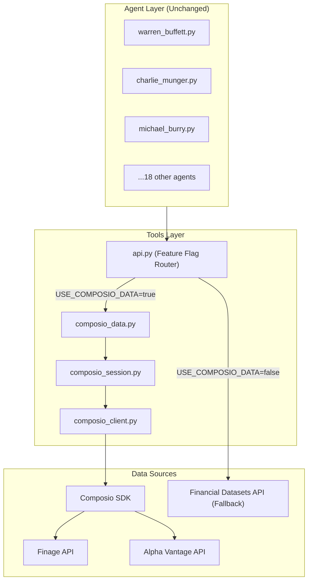

# Composio Direct Tool Execution for AI Hedge Fund

This plan integrates Composio's direct tool execution into the AI Hedge Fund system, replacing direct API calls in [api.py](file:///Users/sahilprasad/Desktop/untitled%20folder%203/ai-hedge-fund/src/tools/api.py) with a multi-source data abstraction layer while preserving all 20 existing agent implementations unchanged.

## Integration Approach

Based on Composio SDK documentation analysis, we use **Direct Tool Execution** pattern:
- `composio.tools.execute(tool_name, user_id=..., arguments=...)` 
- No Tool Router sessions needed for programmatic data fetching
- Simpler, faster, and appropriate for known tool calls

> [!NOTE]
> **Why Direct Execution over Tool Router?**
> - Tool Router is designed for agent frameworks with dynamic tool discovery
> - Our hedge fund agents call specific, known functions
> - Direct execution is simpler and has less overhead

## User Review Required

> [!IMPORTANT]
> **Composio Account Setup Required**: Before implementation, you need a Composio account ([composio.dev](https://composio.dev)) with API key and authenticated connections to Finage and/or Alpha Vantage toolkits.

> [!WARNING]
> **Feature Flag Rollout**: The integration uses a `USE_COMPOSIO_DATA` feature flag defaulting to `false`. This enables parallel testing and easy rollback without code changes.

---

## Current Status Analysis

| Component | Status | Action Required |
|-----------|--------|-----------------|
| `api.py` | ✅ Implemented | None (Ready for testing) |
| `composio_data.py` | ✅ Implemented | None (Ready for testing) |
| `composio_client.py` | ✅ Implemented | None (Ready for testing) |
| `composio_session.py` | ✅ Fixed | Updated to use direct execution API |

## Architecture



---

## Proposed Changes

### Core Composio Integration (Phase 1)

#### [DONE] [composio_client.py](file:///Users/sahilprasad/Desktop/untitled%20folder%203/open-hedge-fund/src/tools/composio_client.py)

Singleton Composio client initialization:
- Load `COMPOSIO_API_KEY` from environment
- Provide `get_composio_client()` factory function
- Handle client initialization errors gracefully

#### [DONE] [composio_session.py](file:///Users/sahilprasad/Desktop/untitled%20folder%203/open-hedge-fund/src/tools/composio_session.py)

Direct tool execution module (renamed from session-based approach):
- Uses `composio.tools.execute(tool_name, user_id=..., arguments=...)` per SDK docs
- No session management needed for direct execution
- Returns standardized `{"successful": bool, "data": ...}` response format

---

### Data Abstraction Layer (Phase 2)

#### [DONE] [composio_data.py](file:///Users/sahilprasad/Desktop/untitled%20folder%203/open-hedge-fund/src/tools/composio_data.py)

**Status**: ✅ Implemented with direct tool execution.

Core data functions with **identical signatures** to [api.py](file:///Users/sahilprasad/Desktop/untitled%20folder%203/open-hedge-fund/src/tools/api.py):

| Function | Description | Model Output |
|----------|-------------|--------------|
| [get_prices(ticker, start_date, end_date, api_key=None)](file:///Users/sahilprasad/Desktop/untitled%20folder%203/ai-hedge-fund/src/tools/api.py#60-93) | Historical OHLCV prices | `list[Price]` |
| [get_financial_metrics(ticker, end_date, period, limit, api_key=None)](file:///Users/sahilprasad/Desktop/untitled%20folder%203/ai-hedge-fund/src/tools/api.py#95-134) | Key financial ratios | `list[FinancialMetrics]` |
| [search_line_items(ticker, line_items, end_date, period, limit, api_key=None)](file:///Users/sahilprasad/Desktop/untitled%20folder%203/ai-hedge-fund/src/tools/api.py#136-175) | Financial statement items | `list[LineItem]` |
| [get_company_news(ticker, end_date, start_date, limit, api_key=None)](file:///Users/sahilprasad/Desktop/untitled%20folder%203/ai-hedge-fund/src/tools/api.py#242-305) | Company news articles | `list[CompanyNews]` |
| [get_market_cap(ticker, end_date, api_key=None)](file:///Users/sahilprasad/Desktop/untitled%20folder%203/ai-hedge-fund/src/tools/api.py#307-341) | Current market cap | `float | None` |
| [get_insider_trades(ticker, end_date, start_date, limit, api_key=None)](file:///Users/sahilprasad/Desktop/untitled%20folder%203/ai-hedge-fund/src/tools/api.py#177-240) | Insider trading data | `list[InsiderTrade]` |

**Key Implementation Details:**
- Preserve existing `_cache` integration from [cache.py](file:///Users/sahilprasad/Desktop/untitled%20folder%203/ai-hedge-fund/src/data/cache.py)
- Transform Composio responses to existing Pydantic models in [models.py](file:///Users/sahilprasad/Desktop/untitled%20folder%203/ai-hedge-fund/src/data/models.py)
- Implement multi-source fallback: Finage → Alpha Vantage → empty result
- Retain `api_key` parameter for backward compatibility (unused with Composio)

---

### Feature Flag Integration (Phase 3)

#### [VERIFY] [api.py](file:///Users/sahilprasad/Desktop/untitled%20folder%203/open-hedge-fund/src/tools/api.py)

**Status**: ✅ Already implemented.

Feature flag routing at module level:

```python
import os

if os.getenv("USE_COMPOSIO_DATA", "false").lower() == "true":
    from src.tools.composio_data import (
        get_prices,
        get_financial_metrics,
        search_line_items,
        get_company_news,
        get_market_cap,
        get_insider_trades,
        prices_to_df,
        get_price_data,
    )
else:
    # Existing implementation stays in place
    pass
```

---

### Environment Configuration

#### [MODIFY] [.env.example](file:///Users/sahilprasad/Desktop/untitled%20folder%203/ai-hedge-fund/.env.example)

Add new environment variables:

```bash
# Composio Tool Router Integration
COMPOSIO_API_KEY=your-composio-api-key
USE_COMPOSIO_DATA=false

# Optional: Auth config IDs for pre-authenticated toolkits
FINAGE_AUTH_CONFIG_ID=your-finage-auth-config-id
ALPHA_VANTAGE_AUTH_CONFIG_ID=your-alpha-vantage-auth-config-id
```

---

### Dependencies

#### [MODIFY] [pyproject.toml](file:///Users/sahilprasad/Desktop/untitled%20folder%203/ai-hedge-fund/pyproject.toml)

Add `composio` dependency (Python 3.8+ compatible):

```toml
[tool.poetry.dependencies]
composio = "^0.6"  # Verify latest version
```

---

### Testing (Phase 4)

#### [NEW] [test_composio_data.py](file:///Users/sahilprasad/Desktop/untitled%20folder%203/ai-hedge-fund/tests/test_composio_data.py)

Unit tests following patterns from [test_api_rate_limiting.py](file:///Users/sahilprasad/Desktop/untitled%20folder%203/ai-hedge-fund/tests/test_api_rate_limiting.py):

- Mock Tool Router session responses
- Test cache hit/miss behavior
- Test response transformation to Pydantic models
- Test multi-source fallback logic
- Test error handling for auth failures

---

## Verification Plan

### Automated Tests

**Run existing tests to ensure no regression:**
```bash
cd /Users/sahilprasad/Desktop/untitled\ folder\ 3/ai-hedge-fund
pytest tests/test_api_rate_limiting.py -v
```

**Run new Composio integration tests:**
```bash
pytest tests/test_composio_data.py -v
```

### Integration Testing

**Test with feature flag disabled (default behavior unchanged):**
```bash
export USE_COMPOSIO_DATA=false
python -c "from src.tools.api import get_prices; print(get_prices.__module__)"
# Expected: src.tools.api
```

**Test with feature flag enabled:**
```bash
export USE_COMPOSIO_DATA=true
export COMPOSIO_API_KEY=your-key
python -c "from src.tools.api import get_prices; print(get_prices.__module__)"
# Expected: src.tools.composio_data
```

### Manual Verification

> [!NOTE]
> Requires valid Composio API key with authenticated financial toolkits.

1. **Single ticker test:**
   ```bash
   export USE_COMPOSIO_DATA=true
   export COMPOSIO_API_KEY=your-key
   python -c "
   from src.tools.api import get_prices
   prices = get_prices('AAPL', '2024-01-01', '2024-01-31')
   print(f'Got {len(prices)} prices')
   print(prices[0] if prices else 'No data')
   "
   ```

2. **Run single agent with Composio data:**
   ```bash
   poetry run python src/main.py --tickers AAPL --agents warren_buffett
   ```

3. **Compare data quality (parallel testing):**
   Run same analysis with both data sources and compare outputs for consistency.

---

## Rollback Plan

If issues occur:
1. Set `USE_COMPOSIO_DATA=false` in environment
2. System immediately reverts to direct Financial Datasets API
3. No code changes needed

---

## Timeline Estimate

| Phase | Description | Hours |
|-------|-------------|-------|
| 1 | Core Composio files (`composio_client.py`, `composio_session.py`) | 2-3 |
| 2 | Data abstraction layer (`composio_data.py`) | 6-8 |
| 3 | Feature flag integration | 1-2 |
| 4 | Testing and verification | 4-6 |
| **Total** | | **13-19** |
